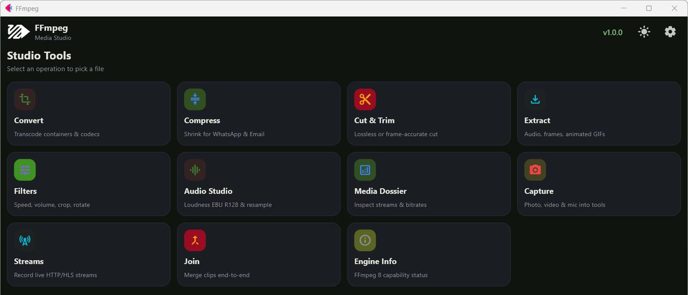

  <picture>
    <source media="(prefers-color-scheme: dark)" srcset="src/assets/icon_white.svg">
    <source media="(prefers-color-scheme: light)" srcset="src/assets/icon.svg">
    
  </picture>

<h1 align="center">FFmpeg Lite</h1>

  On-device media studio built with Python and Flet — transcode, cut, join, extract, and master audio with FFmpeg on your phone and desktop.

  Why "Lite"? <a href="docs/why-ffmpeg-lite.md">The capability contract and the path to the full suite</a>.

  
  
  
  
  
  

---

## Download

| Platform | Download | Notes |
| :---: | :---: | :--- |
| 🤖 **Android** |  | Recommended for Android mobile users |
| 🪟 **Windows** |  | Automated standalone setup installer with desktop shortcut integration |
| 🐧 **Linux (Debian/Ubuntu)** |  | Desktop package tailored for Ubuntu, Debian, Linux Mint & Pop!_OS |
| 🎩 **Linux (Fedora/RHEL)** |  | Desktop package tailored for Fedora, openSUSE, RHEL & CentOS |
| 📦 **Linux (Universal Portable)** |  | Universal standalone portable archive for Arch, Alpine, Steam Deck & all distros |

### Android Architecture Build Splits

| Variant | Download | Notes |
| :--- | :---: | :--- |
| 📱 **ARM64** (most phones) | [**ffmpeg-arm64-v8a.apk**](https://github.com/Nwokike/FFmpeg/releases/latest/download/ffmpeg-arm64-v8a.apk) | Modern 64-bit Android devices |
| 💻 **x86_64** (emulators/Chromebooks) | [**ffmpeg-x86_64.apk**](https://github.com/Nwokike/FFmpeg/releases/latest/download/ffmpeg-x86_64.apk) | Android emulators & Chromebooks |
| 📱 **ARMv7** (older phones) | [**ffmpeg-armeabi-v7a.apk**](https://github.com/Nwokike/FFmpeg/releases/latest/download/ffmpeg-armeabi-v7a.apk) | Legacy 32-bit Android devices |

---

## Screenshots

  

---

## Features

- **Measured Capability Engine** — Codecs, containers, filters, and formats are probed directly from the installed engine. The app only offers what your device can actually run.
- **Convert & Transcode** — Switch containers, adjust CRF quality, and downscale resolution with available hardware or software encoders.
- **Lossless Cut & Trim** — Instant stream-copy cuts without re-encoding, or frame-accurate re-encode with keyframe markers.
- **Smart Joiner** — Merge multiple audio or video clips with instant stream-copy or crossfade transitions.
- **Audio Studio** — Two-pass EBU R128 loudness mastering (YouTube, Podcast, Broadcast presets), channel routing, and resampling.
- **Extract** — Extract audio tracks (AAC, M4A, FLAC, WAV), grab video frames, generate palette-optimized GIFs, or extract subtitle tracks (SRT, WebVTT, ASS).
- **Filter Stack** — Crop, scale, rotate, change playback speed, boost volume, denoise, sharpen, and apply PNG watermarks.
- **Live Stream Recording** — Capture live network streams directly to local media files.
- **Media Dossier** — Inspect detailed stream layouts, bitrates, pixel formats, dispositions, and container metadata.
- **In-App Capture** — Record camera video, snap photos, or record voice memos straight into processing pipelines.
- **Serial Job Queue** — Background worker queue with real-time progress, pause, resume, and cancellation.
- **Local-First Privacy** — All processing happens locally on your device. Your media is never uploaded to the cloud.

---

## Architecture

| Layer | Technology | Purpose |
| :--- | :--- | :--- |
| **Frontend** | Flet 1.0 (Flutter engine) | Cross-platform Material 3 interface |
| **Media Engine** | `av` (PyAV 18 via FFmpeg 8) | Demuxing, decoding, encoding, filtering, and stream copying |
| **Playback** | `flet-video` + `flet-audio` | Live hardware-accelerated preview of inputs and outputs |
| **Capture** | `flet-camera` + `flet-audio-recorder` | In-app photo, video, and microphone recording |
| **Storage** | Flet tiered storage | Isolated data, cache, and temp directory management |

---

## Legal Disclaimer

FFmpeg Lite embeds FFmpeg libraries via PyAV under LGPL-2.1-or-later and IJG. Users are solely responsible for ensuring their use of converted media complies with applicable copyright laws and platform terms of service.
