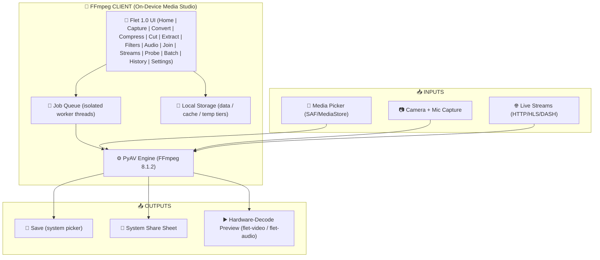

<p align="center">
  <picture>
    <source media="(prefers-color-scheme: dark)" srcset="src/assets/icon_white.svg">
    <source media="(prefers-color-scheme: light)" srcset="src/assets/icon.svg">
    
  </picture>
</p>

<p align="center">
  On-device media studio — convert, transcode, compress, cut, extract and filter any video or audio with the full power of FFmpeg 8
</p>

<p align="center">
  <a href="https://play.google.com/store/apps/details?id=ng.kiri.ffmpeg"></a>
  <a href="https://github.com/Nwokike/FFmpeg/releases/latest"></a>
  <a href="https://github.com/Nwokike/FFmpeg/releases/latest"></a>
  <a href="https://github.com/Nwokike/FFmpeg/releases/latest"></a>
  
  
</p>

---

## Download

| Platform | Download | Notes |
| :---: | :---: | :--- |
| 🤖 **Android** | [](https://play.google.com/store/apps/details?id=ng.kiri.ffmpeg) | Recommended for Android users |
| 🪟 **Windows** | [](https://github.com/Nwokike/FFmpeg/releases/latest/download/FFmpeg.exe) | Automated standalone setup installer with desktop shortcut integration |
| 🐧 **Linux (Debian/Ubuntu)** | [](https://github.com/Nwokike/FFmpeg/releases/latest/download/FFmpeg.deb) | Desktop package tailored for Ubuntu, Debian, Linux Mint & Pop!_OS |
| 🎩 **Linux (Fedora/RHEL)** | [](https://github.com/Nwokike/FFmpeg/releases/latest/download/FFmpeg.rpm) | Desktop package tailored for Fedora, openSUSE, RHEL & CentOS |
| 📦 **Linux (Universal Portable)** | [](https://github.com/Nwokike/FFmpeg/releases/latest/download/FFmpeg.tar.gz) | Universal standalone portable archive for Arch, Alpine, Steam Deck & all distros |

### Android Architecture Build Splits

| Variant | Download | Notes |
| :---: | :---: | :--- |
| 📱 **ARM64** (most phones) | [**ffmpeg-arm64-v8a.apk**](https://github.com/Nwokike/FFmpeg/releases/latest/download/ffmpeg-arm64-v8a.apk) | Modern 64-bit Android devices |
| 💻 **x86_64** (emulator QA) | Not shipped in v1.0.0 | The release target is arm64-v8a; x86_64 can be added as a separate QA build. |

---

## Core Capabilities

| Capability | Description |
| :--- | :--- |
| **Full FFmpeg 8 Engine** | Every codec, container and filter of the bundled FFmpeg build — enumerated live at runtime and surfaced in the UI, so the app always shows exactly what this device can do. |
| **Convert, Transcode & Compress** | Any container to any container, quality presets or target file size ("small enough for WhatsApp/Telegram"), duration presets, bitrate/CRF advanced controls. |
| **Cut / Trim** | Instant stream-copy cuts (keyframe-accurate) or frame-accurate re-encode, scrubbed on a live thumbnail strip. |
| **Extract** | Audio (AAC/MP3/Opus/FLAC/WAV/PCM), frame extraction, palette-optimized GIFs, and SRT/ASS/WebVTT subtitles. |
| **Filters** | Crop, scale, rotate/flip, speed (atempo), volume, denoise, sharpen, image watermark overlay — plus color EQ and any other filter exactly as this device's FFmpeg build supports (the UI names what's missing). |
| **Join** | Merge clips end-to-end: instant lossless when formats match, uniform re-encode when they don't, with optional crossfade transitions. |
| **Audio Studio** | Loudness normalization (two-pass, use-case presets), resampling (incl. soxr), channel mixing, and playback-speed export. |
| **Capture** | In-app camera video/still capture and microphone recording — straight into the conversion pipeline. |
| **Live Streams** | Record HTTP/HTTPS/HLS/DASH streams on-device (feature-gated on engine support). |
| **Batch Jobs** | Multi-file queue with per-job progress, cancel, pause and a jobs banner that survives tab switches. |
| **Media Dossier** | Probe any file: streams, codecs, bitrates, dimensions, rotation, language, chapters — with a raw container summary and a shareable markdown report. Includes lossless track-picker copies (drop audio/subtitle tracks without re-encoding). |
| **Share & Save** | Save to Downloads/Movies via the system picker, or push outputs to any app via the system share sheet. |

---

## Architecture

| Layer | Technology | Purpose |
| :--- | :--- | :--- |
| **Frontend** | Flet 1.0 (Flutter engine) | Cross-platform UI — Material 3 themes, adaptive video controls, on-demand lists, chip-and-slider filter stacks |
| **Media Engine** | `av` (PyAV 18, FFmpeg 8.1.2 bundled) | Decode/encode/mux/filter/resample — in-process, GIL-released C calls, cancel-aware |
| **Playback** | `flet-video` (mpv backend, hardware decode) + `flet-audio` | Live before/after preview of sources and outputs |
| **Capture** | `flet-camera` + `flet-audio-recorder` | In-app video/still/mic capture feeding the engine |
| **Permissions** | `flet-permission-handler` | Just-in-time Android permission flows with graceful degradation |
| **Local Storage** | `FLET_APP_STORAGE_*` tiers (data/cache/temp) | Debounced atomic JSON for settings + job history; regenerable caches |
| **Async Runtime** | `asyncio` + isolated worker threads | One `CodecContext` per thread, ~4 Hz progress publish, cooperative cancellation |

### Visual Flow



---

## Processing Guide

| Job | Typical Time | Notes |
| :--- | :---: | :--- |
| **Stream Copy (remux / cut-copy)** | Seconds | No re-encode — instantaneous, lossless |
| **1080p → 720p H.264** | ~1× duration | Software encode on most SoCs |
| **HEVC encode** | 2–5× slower | Availability depends on device build |
| **GIF (palette-optimized)** | ~10–20 s / 15 s clip | Two-pass `palettegen`/`paletteuse` |
| **Loudness normalize** | ~2× pass | Two-pass `loudnorm` measurement + application |

---

## Screenshots

The release screenshots are kept in [`screenshots/`](screenshots/) and should be refreshed whenever the main navigation or Settings surface changes.


## Production release status

`v1.0.0` is prepared as a closed-testing release. It intentionally uses Google test AdMob units while the AdMob production account is being finalized. Test units are not a public-production configuration; swap all IDs with [`tools/admob.py`](tools/admob.py) before the Play production release.

The release workflow blocks test IDs on later production tags, runs the locked test suite, validates version/build identity, builds mobile wheels without hiding failures, and checks that development-only files do not enter Android artifacts.

## Development and release checks

```text
uv sync --frozen
uv run pytest -m "not live"
uv run ruff check .
uv run ruff format --check .
uv run python tools/check_release_consistency.py
uv run flet run -v
uv run --frozen flet build apk --python-version 3.14 --split-per-abi -v
```

The CLI engine audit outputs used during the v1.0.0 preparation are kept outside Git in `audit-output/` so they can be inspected and deleted without affecting the repository.

## Privacy & Security

1. **On-Device Processing** — media never leaves your phone; no cloud uploads, ever.
2. **Minimal Network Use** — the only network calls are update checks, in-app ads (AdMob, with startup UMP consent where required), and stream capture when you explicitly provide a URL. No analytics, no crash reporting, no media uploads.
3. **Data Sovereignty** — outputs are written where you choose via the system picker or share sheet; nothing is auto-synced.
4. **Local-First Storage** — settings, history and caches live in the app's private storage tiers and are fully clearable.

---

## Legal Disclaimer

This app embeds FFmpeg libraries (LGPL/GPL components) via PyAV (BSD-3-Clause). You are solely responsible for ensuring your use of converted media complies with applicable copyright law and the terms of service of any platform you share content to. The authors take no responsibility for misuse of this tool.

---

## License

Proprietary © 2025–2026 Kiri Research Labs. See [`LICENSE`](LICENSE).

## Credits

- **Media engine:** [PyAV](https://github.com/PyAV-Org/PyAV) (BSD-3) — Pythonic bindings for [FFmpeg](https://ffmpeg.org/)
- **UI:** [Flet](https://flet.dev) 1.0 (Flutter engine)
- **Mobile wheels:** Flet's binary index [pypi.flet.dev](https://pypi.flet.dev) (Mobile Forge)
